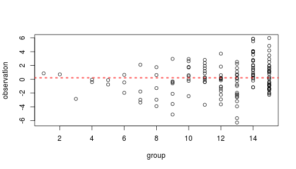
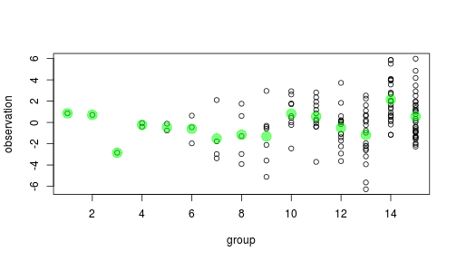
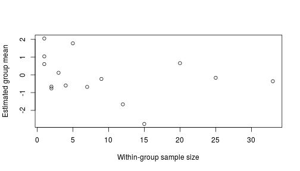

<style type="text/css">
.small-code pre code {
font-size: 1.1em;
}
</style>

QDT: hierarchical models 2
========================================================
author: Max Joseph
date: Dec 3, 2014
font-import: http://fonts.googleapis.com/css?family=Arvo
font-family: 'Arvo', serif
transition: fade
transition-speed: fast


========================================================

### Why use hierarchical models?

Account for nesting?
- can also be done with fixed effects*

*hierarchical models very useful here, but far from the only reason to use them


========================================================

### Other advantages of hierarchical models:
- shrinkage
- prediction

========================================================


How to estimate a group mean $\alpha_j$ with data $y_{ij}$ from $J$ groups?

 


===========================================================

### ANOVA perspective

Choose between two models

1. Grand mean/total pooling: $\bar Y_{..}$ 

$$ \mu_1 = \mu_2 = ... = \mu_K $$

 


===========================================================

### ANOVA perspective

Choose between two models

1. Grand mean: $\bar Y_{..}$

2. Indep. means/no pooling: $\bar Y_{j.}$

 

==========================================================
class: small-code

### ANOVA  perspective


```r
anova(mod1, mod2)
```

```
Analysis of Variance Table

Model 1: Y ~ 1
Model 2: Y ~ 1 + factor(id)
  Res.Df    RSS Df Sum of Sq      F  Pr(>F)  
1    139 604.67                              
2    125 502.88 14    101.79 1.8072 0.04434 *
---
Signif. codes:  0 '***' 0.001 '**' 0.01 '*' 0.05 '.' 0.1 ' ' 1
```

==========================================================

### Motivating shrinkage

What's the deal with small $n_j$?

 

==========================================================

### Motivating shrinkage

Mixtures of sample and grand means predict better:

$$ \hat \alpha_j = \lambda_j \bar y_{j.} + (1 - \lambda_j) \bar y_{..}$$

Compromise between no pooling ($\lambda = 1$) and total pooling ($\lambda=0$)

===================================================

### Hierarchical models

$$y_{ij} \sim Normal(\alpha_j, \sigma_y)$$

$$ \alpha_j \sim Normal(\mu_{\alpha}, \sigma_{\alpha})$$

===================================================

### Hierarchical models

$$y_{ij} \sim Normal(\alpha_j, \sigma_y)$$

$$ \alpha_j \sim Normal(\mu_{\alpha}, \sigma_{\alpha})$$

Amt shrinkage:
- information in group j (e.g. $n_j$)
- variance attributable to groups

$$\dfrac{\sigma_\alpha}{\sigma_\alpha + \sigma_y}$$

=========================================================

### Connection to ANOVA

$$y_{ij} \sim Normal(\alpha_j, \sigma_y)$$

$$ \alpha_j \sim Normal(\mu_{\alpha}, \sigma_{\alpha})$$

$$0 < \sigma_\alpha < \infty$$

Compromise between 
- Total pooling: $\sigma_\alpha = 0$

- No pooling: $\sigma_\alpha = \infty$

Synonyms
================================================

- "partial pooling" 
- "semi-pooling"
- "hierarchical pooling"
- "shrinkage"
- "borrowing information"
- "borrowing strength (of information)"

=========================================================

Demo: [shrinkage.R](https://github.com/mbjoseph/hierarchical_models/blob/master/R_examples/shrinkage.R), [nba_freethrows.R](https://github.com/mbjoseph/hierarchical_models/blob/master/R_examples/nba_freethrows.R)


========================================================

### Prediction

Two kinds:

1. Future $\tilde Y$ from observed groups, with means $\alpha_1, \alpha_2, ..., \alpha_J$

2. $\tilde Y$ from future groups, with means $\alpha_{J+1}, \alpha_{J+2}, ...$

========================================================

### Quick note: Bayes vs. ML 

Predictions should incorporate uncertainty in parameters

Easy with MCMC

More difficult in ML framework


=========================================================

### Posterior predictive distributions

$p(\tilde y | y)$

=========================================================

### Posterior predictive distributions

$p(\tilde y | y)$

$= \int_\theta p(\tilde y, \theta | y) d \theta$

=========================================================

### Posterior predictive distributions

$p(\tilde y | y)$

$= \int_\theta p(\tilde y, \theta | y) d \theta$

$= \int_\theta p(\tilde y | \theta) p(\theta | Y) d \theta$

^ integrating over uncertainty in parameters
 
=========================================================

### Posterior predictive distributions

$p(\tilde y | y)$

$= \int_\theta p(\tilde y, \theta | y) d \theta$

$= \int_\theta p(\tilde y | \theta) p(\theta | Y) d \theta$

Discretized, summing over posterior simulations:

$\approx \frac{1}{S}\sum_{s=1}^{S} p(\tilde y | \theta^s)$


=========================================================

### Posterior predictive distributions

Observed groups:


$p(\tilde y | y) = \frac{1}{S} \sum_{s=1}^S p(\tilde y | \alpha_j^s, \sigma_y^s)$


1. Draw $\alpha_j$ and $\sigma_y$ from posterior

2. Draw $\tilde y$ from $N(\alpha_j, \sigma_y)$

=========================================================

### Posterior predictive distributions

Future groups:

$p(\tilde y | y) = \frac{1}{S} \sum_{s=1}^S p(\tilde y | \alpha_j^s, \sigma_y^s) p(\alpha_j^s| \mu_\alpha^s, \sigma_\alpha^s)$

1. Draw $\mu_\alpha$, $\sigma_\alpha$, and $\sigma_y$ from posterior

2. Draw new $\alpha_j$ from population distribution $N(\mu_\alpha, \sigma_\alpha)$

3. Draw $\tilde y$ from $N(\alpha_j, \sigma_y)$

========================================================

Demo: [prediction.R](https://github.com/mbjoseph/hierarchical_models/blob/master/R_examples/prediction.R)
