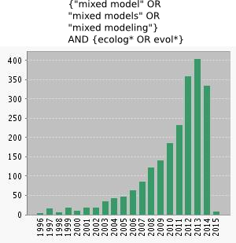
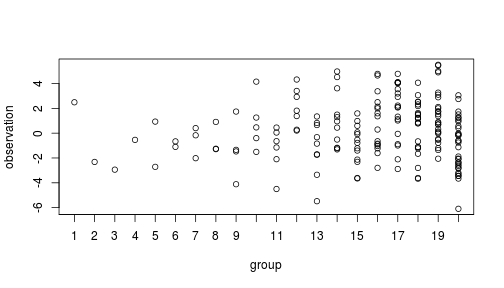
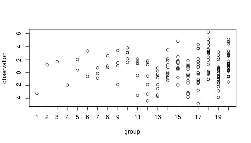
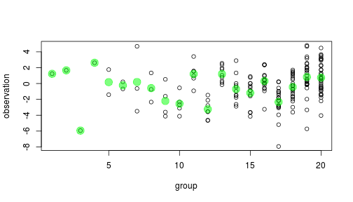
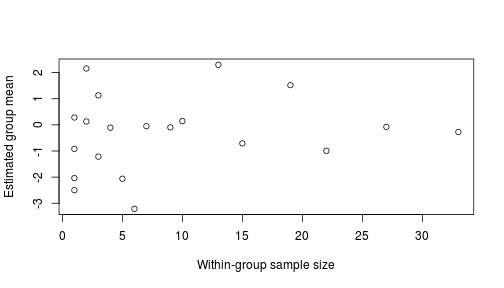
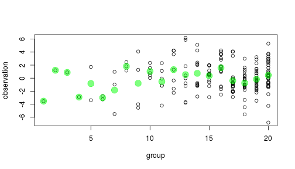
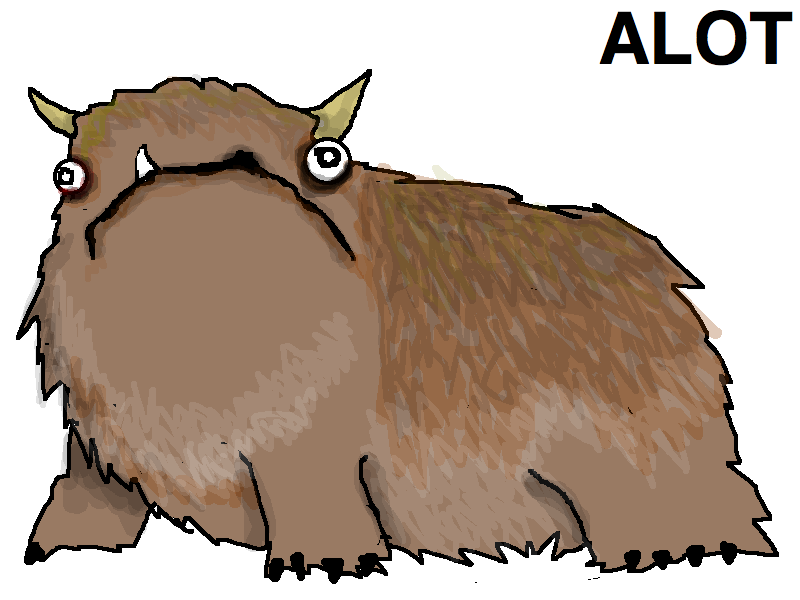
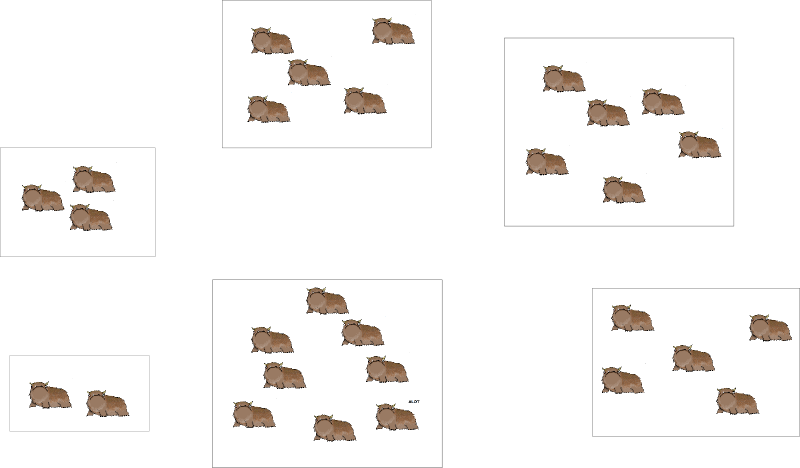

<style type="text/css">
.small-code pre code {
font-size: 1.1em;
}
</style>

Mixed models
========================================================
author: Max Joseph
date: Jan 14, 2014
font-family: 'Helvetica', serif
transition: fade
transition-speed: fast

========================================================
class: small-code

### Preface

Getting files:

[github.com/mbjoseph/hierarchical_models](github.com/mbjoseph/hierarchical_models)

Download as zipped folder 

or


```
git clone git@github.com/mbjoseph/hierarchical_models
```

========================================================

### Overview

1. Why bother?

2. Random intercept models

3. Random slope and intercept models

4. Other resources

========================================================

### Why bother?



========================================================

### Why bother? 

- increasing use
- broader scope of inference

========================================================

### Why bother? 

- increasing use
- broader scope of inference
- *improved estimates*

========================================================

### Scenario

Estimate group means $\alpha_j$ with data $y_{ij}$ from $J$ groups

Tragically unequal sample sizes


 


===========================================================

### Overly optimistic ANOVA

Choose between two models

1. Grand mean/total pooling: $\bar Y_{..}$ 

$$ \mu_1 = \mu_2 = ... = \mu_K $$

 


===========================================================

### Overly Optimistic ANOVA

Choose between two models

1. Grand mean: $\bar Y_{..}$

2. Indep. means/no pooling: $\bar Y_{j.}$

 

==========================================================
class: small-code

### Overly optimistic ANOVA


```r
anova(mod1, mod2)
```

```
Analysis of Variance Table

Model 1: Y ~ 1
Model 2: Y ~ 1 + factor(id)
  Res.Df    RSS Df Sum of Sq      F  Pr(>F)  
1    186 989.73                              
2    167 835.36 19    154.37 1.6242 0.05541 .
---
Signif. codes:  0 '***' 0.001 '**' 0.01 '*' 0.05 '.' 0.1 ' ' 1
```

==========================================================

What's the deal with small sample sizes $n_j$?

 


==========================================================

### Overfitting much?

High parameter to data ratio for small $n_j$

 


==========================================================

Is there an option better than $\bar y_{j.}$?

Oddly, yes! When we have > 2 groups (see [Stein's paradox](http://statweb.stanford.edu/~ckirby/brad/other/Article1977.pdf))

 

==========================================================

### Conceptualizing a better estimate

Which estimates do we trust least?

What information can improve those estimates?

 

==========================================================

### A better estimate

Mixture of sample and grand mean:

$$ \hat \alpha_j = \lambda_j \bar y_{j.} + (1 - \lambda_j) \bar y_{..}$$

$$ 0 < \lambda < 1$$


==========================================================

### A better estimate

Mixture of sample and grand mean:

$$ \hat \alpha_j = \lambda_j \bar y_{j.} + (1 - \lambda_j) \bar y_{..}$$

$$ 0 < \lambda < 1$$

Compromise b/t: 

total pooling ($H_0: \lambda=0$) & no pooling ($H_A: \lambda = 1$)


===================================================

### Hierarchical models

Random effects impose shrinkage!

$$y_{ij} \sim Normal(\alpha_j, \sigma_y)$$

$$ \alpha_j \sim Normal(\mu_{\alpha}, \sigma_{\alpha})$$


===================================================

### Hierarchical models

$$y_{ij} \sim Normal(\alpha_j, \sigma_y)$$

$$ \alpha_j \sim Normal(\mu_{\alpha}, \sigma_{\alpha})$$

Amt shrinkage:
- information in group j (e.g. $n_j$)
- variance attributable to groups

$$\dfrac{\sigma_\alpha}{\sigma_\alpha + \sigma_y}$$

=========================================================

### Connection to ANOVA

$$y_{ij} \sim Normal(\alpha_j, \sigma_y)$$

$$ \alpha_j \sim Normal(\mu_{\alpha}, \sigma_{\alpha})$$

$$0 < \sigma_\alpha < \infty$$

Compromise b/t
- Total pooling: $\sigma_\alpha = 0$

- No pooling: $\sigma_\alpha = \infty$

Synonyms
================================================

- "partial pooling" 
- "semi-pooling"
- "hierarchical pooling"
- "shrinkage"
- "borrowing information"
- "borrowing strength (of information)"

=========================================================

Demo: [shrinkage.R](https://github.com/mbjoseph/hierarchical_models/blob/master/R_examples/shrinkage.R)

========================================================

### Recap

Random effects impose partial pooling

$$y_{ij} \sim Normal(\alpha_j, \sigma_y)$$

$$ \alpha_j \sim Normal(\mu_{\alpha}, \sigma_{\alpha})$$


*see [nba_freethrows.R](https://github.com/mbjoseph/hierarchical_models/blob/master/R_examples/nba/nba_freethrows.R) for a real-world example

========================================================

### Aside

Scope of inference:

Observed sites or groups $j \in {1, ..., J}$

*and*

Unobserved sites or groups $j \in {J+1, ...}$

see [prediction.R](https://github.com/mbjoseph/hierarchical_models/blob/master/R_examples/prediction.R) for more

========================================================

### Mixed effects

Combination of fixed *and* random effects

e.g. let's say we study Alot blood parasites



*[source](http://hyperboleandahalf.blogspot.com/2010/04/alot-is-better-than-you-at-everything.html)

====================================================================

###  Questions & sampling scenario

Do large-bodied Alots have more blood parasites?

Random sample of $n_j$ individuals at each of $J$ sites.



====================================================================

[Alot example](https://github.com/mbjoseph/hierarchical_models/blob/master/R_examples/alot/alot_analysis.R)

====================================================================

### Other resources

Mixed Effects Models and Extensions in Ecology with R (2009). Zuur, Ieno, Walker, Saveliev and Smith. Springer.

lme4: Mixed-effects modeling with R (2010). Bates, Douglas. Springer.

Generalized linear mixed models: a practical guide for ecology and evolution (2009). Benjamin M. Bolker, et al. TREE.

