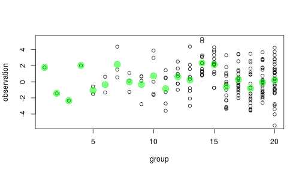
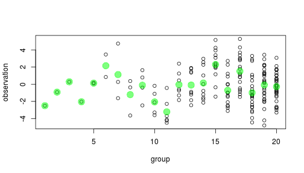

<style type="text/css">
.small-code pre code {
font-size: 1.1em;
}
</style>

Mixed models
========================================================
author: Max Joseph
date: Jan 14, 2014
font-import: http://fonts.googleapis.com/css?family=Arvo
font-family: 'Arvo', serif
transition: fade
transition-speed: fast

========================================================

### Increasing use

 

========================================================

### ANOVA

How to estimate a group mean $\alpha_j$ with data $y_{ij}$ from $J$ groups?

 


===========================================================

### ANOVA perspective

Choose between two models

1. Grand mean/total pooling: $\bar Y_{..}$ 

$$ \mu_1 = \mu_2 = ... = \mu_K $$

 


===========================================================

### ANOVA perspective

Choose between two models

1. Grand mean: $\bar Y_{..}$

2. Indep. means/no pooling: $\bar Y_{j.}$

 

==========================================================
class: small-code

### ANOVA  perspective


```r
anova(mod1, mod2)
```

```
Analysis of Variance Table

Model 1: Y ~ 1
Model 2: Y ~ 1 + factor(id)
  Res.Df    RSS Df Sum of Sq      F    Pr(>F)    
1    183 838.05                                  
2    164 582.67 19    255.38 3.7831 1.507e-06 ***
---
Signif. codes:  0 '***' 0.001 '**' 0.01 '*' 0.05 '.' 0.1 ' ' 1
```

==========================================================

### Motivating shrinkage

What's the deal with small sample sizes $n_j$?

 


==========================================================

### Motivating shrinkage

Do we really believe that groups with small $n_j$ are more variable?

 


==========================================================

### Motivating shrinkage

Or, alternatively, are we overfitting the data for small groups?

- high parameter to data ratio for small $n_j$

 


==========================================================

### Motivating shrinkage

Is there a better estimate for a group mean, other than the sample mean for the group?

YES! When we have > 2 groups (see [Stein's paradox](http://statweb.stanford.edu/~ckirby/brad/other/Article1977.pdf))

 


==========================================================

### Borrowing information

Mixture of sample and grand mean:

$$ \hat \alpha_j = \lambda_j \bar y_{j.} + (1 - \lambda_j) \bar y_{..}$$


==========================================================

### Borrowing information

Mixture of sample and grand mean:

$$ \hat \alpha_j = \lambda_j \bar y_{j.} + (1 - \lambda_j) \bar y_{..}$$

Compromise between no pooling ($H_A, \lambda = 1$) and total pooling ($H_0 \lambda=0$)

===================================================

### Hierarchical models

Random effects impose shrinkage!

$$y_{ij} \sim Normal(\alpha_j, \sigma_y)$$

$$ \alpha_j \sim Normal(\mu_{\alpha}, \sigma_{\alpha})$$


===================================================

### Hierarchical models

$$y_{ij} \sim Normal(\alpha_j, \sigma_y)$$

$$ \alpha_j \sim Normal(\mu_{\alpha}, \sigma_{\alpha})$$

Amt shrinkage:
- information in group j (e.g. $n_j$)
- variance attributable to groups

$$\dfrac{\sigma_\alpha}{\sigma_\alpha + \sigma_y}$$

=========================================================

### Connection to ANOVA

$$y_{ij} \sim Normal(\alpha_j, \sigma_y)$$

$$ \alpha_j \sim Normal(\mu_{\alpha}, \sigma_{\alpha})$$

$$0 < \sigma_\alpha < \infty$$

Compromise between 
- Total pooling: $\sigma_\alpha = 0$

- No pooling: $\sigma_\alpha = \infty$

Synonyms
================================================

- "partial pooling" 
- "semi-pooling"
- "hierarchical pooling"
- "shrinkage"
- "borrowing information"
- "borrowing strength (of information)"

=========================================================

Demo: [shrinkage.R](https://github.com/mbjoseph/hierarchical_models/blob/master/R_examples/shrinkage.R)

========================================================

### Recap

Random effects impose structure on parameters

$$y_{ij} \sim Normal(\alpha_j, \sigma_y)$$

$$ \alpha_j \sim Normal(\mu_{\alpha}, \sigma_{\alpha})$$


========================================================

### Mixed effects

Combination of fixed *and* random effects

e.g. let's say I'm studying Alot blood parasites


* image & concept from [Hyperbole and a Half](http://hyperboleandahalf.blogspot.com/)

====================================================================

###  Questions & sampling scenario

Let's say I want to know in general whether large-bodied Alots have higher blood parasite levels .

Random sample of $n_j$ individuals at each of $J$ sites.

I expect among-site variation and among-size variation. 

====================================================================

### Alot example
